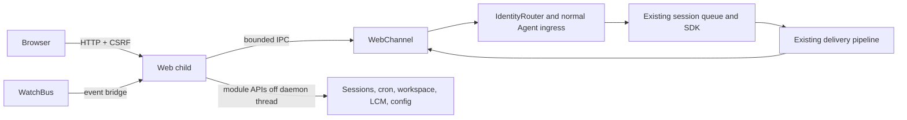

# Proposal: local web UI

**Status:** approved, including the 2026-09-16 review update: persistent token authentication and opt-in Tailscale Serve access supersede the original no-login/local-access-only requirement. PR 2 implements the web channel, service, and minimal chat.

Reviewed against `255cb7f1ee7bb32f24a86550a4b73ae39e8b3058` (2026-09-14), using the supplied HTML mockup as the visual reference.

## Architecture

Register a real `WebChannel` with the existing Agent. Run HTTP, static assets, SSE, and expensive filesystem reads in a supervised child process, connected to the daemon by bounded, typed IPC. The child does not instantiate another Agent, scheduler, or SDK query.

Proposed config: `web.enabled: true`, `web.port: 9465`, optional `web.ownerIdentity` and exact HTTPS `web.externalOrigin`. The listener remains on `127.0.0.1`; Tailscale Serve may proxy the configured external origin. Start with `tomo start`; log the private token-bearing access URL without opening a browser. Preserve the existing configured-messaging-channel requirement initially. Invalid web-specific settings disable the UI with a diagnostic rather than stopping the daemon; existing core config validation remains intact.

Add `src/channels/web.ts`, supervisor/API code under `src/web/`, and a separate browser package under `web/`. Use strict TypeScript, the existing React major, stable compatible Vite tooling, accessible primitives, and mockup-derived CSS tokens. Verify current stable releases and Node 22.12 compatibility at implementation time. Bundle assets into the npm distribution; no runtime CDN or development server.

### Source findings that affect the design

| Existing module | Reuse / necessary extension |
| --- | --- |
| `channels/types.ts`, `router.ts`, `agent.ts` | DMs already unify across providers, but routing returns one reply target and group keys encode a provider. Separate transport, canonical session audience, and delivery destination. |
| `agent/live-session.ts`, `agent/turn-runner.ts` | Already stream completed content blocks; partial-token events are deliberately disabled. Keep existing silence, filtering, retry, and delivery-failure semantics. |
| `sessions/store.ts` | Owns locks, transcript filenames, archives, sidecars, and collision handling. Extract bounded read-only access using these rules; do not construct paths or use a stale second `get()` cache. |
| `watch/{bus,server,protocol,snapshot}.ts`, `metrics/exporter.ts` | Reuse activity events, backpressure patterns, and nonfatal listener handling. Watch transcripts are clipped to 1,500 characters and cannot supply full chat history. |
| `config.ts`, `cli/config/shared.ts` | Existing Zod validators are distributed, not an exported complete file schema. Saving has guarded reads, backup, atomic writes, and `0600`, but needs a transaction lock and revision checks. |
| `mcp/{external-config,oauth}.ts` | Parsing removes disabled entries and expands environment values. OAuth status treats mounting as connected; actual transport health needs a bounded SDK status adapter. |
| `workspace/index.ts`, `lcm/`, `cli/{status,lcm}.ts` | Reuse memory-root conventions and existing context calculations; extract the CLI's summary-block reader into LCM. No general memory-browser API exists yet. |

## Channel, routing, and delivery

**Owner DM:** resolve the unique configured identity through the existing identity/migration path. With multiple identities require `web.ownerIdentity`; never select the first person's DM silently. Browser requests cannot assert owner identity, provider sender IDs, raw reply destinations, or filesystem paths.

**Groups are read-only:** resolve an opaque selection token against the existing session catalog for history and context inspection. The HTTP layer, WebChannel, and router reject browser input targeting a group. Only the configured owner DM accepts browser messages. Provider summon/dismiss behavior and group privacy classification remain unchanged.

**Delivery:** browser-originated owner turns reply through the web channel, with a request-bound outlet independent of the canonical DM session. Provider messages, cron, continuity, and explicit `send_message` retain their destinations. Never replace the persistent notification target with web `last-active` state.

Partition batching/steering when delivery destinations or privacy audiences are incompatible. Keep one execution queue per canonical session, so a browser and provider message cannot accidentally change each other's recipients.

**Streaming and recovery:** deliver completed blocks through the existing pipeline into `WebChannel.send()`, preserving `NO_REPLY`, scaffold/privacy/media filtering, ordered settlement, and no retry after a send attempt. Web delivery means acceptance into a bounded daemon mailbox, not a browser read receipt; overflow or service failure enters the existing failure path. Never wait for a slow browser.

The existing transcript writer remains authoritative. Add optional request/turn/block correlation metadata there; the web channel must not append duplicate assistant entries. Keep clipped watch text for TUI compatibility and add references for full browser history. Use sidecar-safe opaque pagination cursors rather than assuming `seq` is globally unique.

POST acknowledgment means daemon custody, not completion. A request ID deduplicates retries while its receipt is retained within a daemon epoch, including child restarts; conflicting reuse returns `409`. Every mutation carries the observed daemon epoch; an old epoch returns `409`. After a daemon crash or settled-receipt eviction, request lookup reports unknown without scanning transcripts, which cannot establish a delivery outcome. The browser preserves an uncertain draft and never automatically resubmits. Do not promise exactly-once execution across crashes. PR 2 bounds admission to 32 active and 4,096 retained receipts. At capacity it evicts the oldest settled receipt; failed deliveries that still have active turns cannot be evicted. Clients must never automatically resubmit an unknown request, and deduplication is not indefinite after eviction.

SSE uses epoch-scoped event IDs, bounded replay, and snapshot watermarks: subscribe/buffer before snapshot, then replay transient tool/typing activity and deliver newer events. Durable blocks and request states come from the snapshot, so old replay cannot resurrect settled work. A gap triggers canonical history refresh. Forward tool names, status, and attributed sessions; omit raw arguments/results and unattributed activity.

## API surface

All paths use `/api/v1`, shared typed contracts, server validation, bounded responses, and sanitized errors.

| Endpoint | Purpose |
| --- | --- |
| `GET /bootstrap` | Epoch/version, capabilities, owner state, CSRF token, config revision. |
| `GET /sessions` | Known sessions and opaque selection tokens. |
| `GET /sessions/:id/messages?cursor=…` | Full canonical history pages. |
| `POST /messages`; `GET /messages/:requestId` | `{requestId, targetId?, text}`; default owner DM, `202` after custody, query outcome. Text-only initially. |
| `GET /events` | Same-origin fetch SSE: safe activity, delivery references, invalidation/resync. |
| `GET /todos` | `memory/TODO*.md` and read-only checkbox state. |
| `GET /cron`; `PATCH /cron/:id`; `DELETE /cron/:id` | Full job fields; confirm enable/disable/delete, then existing store operations with revision guards. |
| `GET /memory/tree`, `/memory/file`, `/memory/search` | Read-only bounded browser and literal search. |
| `GET /sessions/:id/context` | Usage/window, freshness, estimated breakdown, available compact/rollup history. |
| `GET /mcp`; `POST /mcp/preview`, `/mcp/apply` | Saved definitions, per-session live status, validated add/edit/remove/enable operations. |
| `GET /config/schema`, `/config`; `POST /config/preview`, `/config/apply` | Schema metadata, safe values, exact reviewed patch and revision. |
| `POST /restart` | Confirmed reason and config revision; dispatch existing restart path. |

Use `403` for security/admission rejection, `409` for stale state, `422` for validation/unschedulable jobs, `429` for limits, and `503` for unavailable services. Distinguish unavailable data from a genuinely empty view.

## Security and failure isolation

The revised trust boundary requires a private access token in addition to browser-origin checks. Other OS accounts or sandboxes without access to the token file cannot obtain web access. Processes with the owner's file access remain trusted.

- Accept only the exact local Host/Origin pair, plus an optional exact HTTPS Tailscale Serve origin from `web.externalOrigin`. Requests use exact equality, never suffix or wildcard matching. Reject missing/duplicate Host, alternate host spellings, absolute-form targets, and any present Origin other than the exact advertised origin, including `null`. Ignore forwarding headers. API reads, bootstrap, and SSE require a custom request header plus same-origin fetch metadata; a normal GET may omit Origin only with those guards. Cross-origin preflights receive no CORS permission.
- Generate/reuse a private 32-byte `web-token` file (`0600`) under the runtime home using the existing lock and atomic replacement. Perform disk work only in the supervised child. Failure to persist safely disables the UI without blocking the daemon. Bootstrap requires the access token or a valid signed origin-bound cookie; all other APIs, including reads and SSE, require that cookie. Static assets remain public.
- Log a private access URL with `?t=<token>` at readiness; remove the query parameter from browser history before bootstrap. Do not persist it in JavaScript storage. Signed HttpOnly, SameSite=Strict cookies last 30 days and survive restarts with the same token; HTTPS adds Secure. Rotate the file to revoke access.
- Mutations also require exact Origin, JSON, and a random cookie-bound CSRF header. CSRF expires independently after 12 hours. On a definite `invalid_csrf` rejection, refresh bootstrap and retry once using the same request ID and epoch; never retry network uncertainty or cross epochs.
- Tailscale Serve runs on the same host and forwards to loopback, preserving Host/Origin. Do not use Funnel or public deployment. Tailnet identity headers are not an authentication substitute; access tokens are mandatory.
- Self-host assets and enforce CSP: self scripts/styles/fonts/connections, no eval/inline scripts, no framing, no objects/base overrides. Add no-referrer, nosniff, and no-store for private responses. Render markdown without raw HTML, executable links, or automatic remote images.
- Workspace APIs reject traversal, absolute paths, special files, and escaping symlinks; verify opened-file identity against symlink swaps. Bound depth, bytes, search duration, and concurrency. The owner memory view can include private files but never injects them into a selected group prompt.
- Secrets appear only as set/unset, with replacement-only inputs and no suffix hints. Apply schema classification and existing redaction rules, treating unknown extension values and arbitrary MCP env/header values, arguments, and credential-bearing URLs as opaque. Never serialize expanded secrets, raw config errors, or submitted replacements into responses/diffs/events/logs.
- Bound IPC and mailbox bytes, in-flight requests, body sizes, and client buffers. No full disk scans on the daemon thread. Handle import/listen/child/request failures locally. Startup has a deadline and resolves degraded instead of rejecting Agent startup. A hung/crashed child gets limited backoff retries, then stays disabled. All Channel shutdown phases remain intact; browser disconnects never cancel accepted agent work.

## Reusing data and management modules

**TODO/memory:** add shared bounded read APIs under `src/workspace/`, using `RuntimePaths`; no second task store or memory writes. Show checked/unchecked markdown state and distinct missing/unreadable states.

**Cron:** use fresh store reads, `setEnabled`, `remove`, existing formatters, and existing locks/merge semantics. Revision checks belong inside the protected operation. Confirm all three mutations with job and target; disabling/deleting does not cancel an in-flight turn. Warn when re-enabling an overdue one-shot will schedule it immediately, as the store already specifies.

**Context:** the pressure meter uses persisted `contextUsed/contextMax`, as status does. `computeContextStats()` supplies a separately labeled estimated breakdown. Preserve `contextEstimated` across reconnect through additive metadata; unknown window is unavailable, not zero usage. Extract the existing block reader into LCM and reuse it in CLI/web. Current summary blocks and recent bus compactions are available history, not a complete audit log; never invent missing token counts.

**Config:** extract existing validators into a side-effect-free shared schema/field-metadata layer, retaining defaults, coercion, aliases, and environment precedence. Extend MCP validation there. UI widgets use metadata; the server validates through the same schema as startup/CLI.

Move guarded load/save behind a common transaction: lock using `file-lock.ts`, re-read, compare revision, apply patch, validate, back up only a valid source, and atomically save `0600`. Migrate all application config writers to that service; a web-only lock is insufficient. Preserve unknown fields and raw environment placeholders. Preview creates a short-lived proposal bound to candidate/browser/base revision; apply writes only that reviewed candidate. Untouched secret placeholders never become saved strings. Display saved, environment-overridden, and running values distinctly.

**MCP/restart:** list saved definitions before disabled servers are filtered out. Combine existing OAuth/mount information with a timeout-bounded connection-status query from active SDK sessions, after verifying the pinned SDK API. No new connection or OAuth flow on GET; unavailable health is unknown, never inferred healthy. Show per-session differences and saved-versus-running state. Config edits require restart; retain the existing OAuth refresh hot-mount behavior separately.

Restart dispatches the installed CLI's `restart --reason` path in `src/cli/daemon.ts` with an argument array and without inherited session-deferral markers. The restart worker must outlive the old daemon. Preserve drain/launchd behavior and show completion only after a new epoch reconnects. Show any new port or disabled-UI state before restarting.

## Visual direction

Preserve the mockup's Enso mark, warm paper, ink text, serif headings, sans-serif chat, mono metadata, 740px chat measure, fine borders, and small radii. Day tokens: `#F4EFE6` background / `#FBF8F1` paper / `#2A2622` ink / `#6B7A5E` accent; night: `#1E1C1B` / `#27231F` / `#E8E2D6` / `#C9A97A`. Adjust muted colors for contrast. Use 4px spacing increments, 4/10px radii, and 150–200ms reduced-motion-aware state feedback.

Keep Conversation and The Study, adding a session picker and accurate connection/delivery labels. Study contains TODOs, Cron, Memory, Context, MCP, and Config. Replace demo content/controls with real capabilities; omit fake statistics, unsupported persona/creativity controls, and unimplemented voice/upload buttons. Light/dark/system themes, labeled controls, visible focus, keyboard dialogs/navigation, 44px touch targets, IME-safe Enter, restrained live announcements, and preserved history scroll position are required. Verify tablet (768px) and desktop layouts and all loading/empty/error/reconnecting states.

## PR sequence and test evidence

1. **Design only:** review this proposal before implementation.
2. **Web channel backend:** isolation/security, routing/delivery separation, history, streaming, minimal real chat; unit, DM/group integration, and browser chat E2E tests.
3. **Inspection views:** TODO/cron/memory/context; store-backed confirmed cron mutations, confinement and CLI-parity tests.
4. **MCP/config:** shared schema/transaction extraction (split if needed), secret-safe diff/save, live status and restart; stale-write/redaction/status/restart tests.
5. **Polish:** responsive/accessibility/theme/recovery, packaging and docs. Essential accessibility/security begin in the first implementation PR.

Reuse Vitest's existing Agent harness with temporary runtime roots and a deterministic SDK double. E2E drives real HTTP/CSRF/IPC/SSE without external credentials. Cover interleaved provider/web input, fixed/last-active delivery, group privacy and summons, shutdown custody, duplicate requests, multi-block/late-NO_REPLY/failure ordering, long history, reconnect, hostile headers/markdown/paths, config races, and UI child failure while another channel completes a turn.

For every added behavior, keep tests unchanged and revert its implementation hunk (or apply an equivalent targeted mutation) in an isolated checkout. Record the command, meaningful behavioral failure, and restored pass; compile/import failure alone is insufficient. Never touch a real daemon/config during tests. Run lint, build/tsc, Vitest, coverage, browser E2E, and npm-pack/install asset smoke tests. Extend CI to the browser while retaining Node 22.12/24/26. Each PR requires green CI and review; no automatic merge. New fixtures/docs contain only synthetic non-personal data.

## Approved review decisions

1. Group sessions are read-only in the browser: history and context inspection only. Owner DM is the sole writable target.
2. Completed-block streaming through the existing delivery pipeline is approved. No token deltas.
3. Use a unique owner or require `web.ownerIdentity` when ambiguous. Port `9465`, enabled by default, with the existing messaging-channel startup requirement.
4. Architecture and PR sequence are approved. PR 2 may proceed; subsequent PRs remain separately reviewable. Never merge automatically.

### Review follow-up

The 2026-09-16 approval includes all seven review findings. JSON body capacity covers the full UTF-16 input limit including escapes; invalid optional web config uses the existing warning logger; browser-only packages are build dependencies; stale history cursors return 409 and reload the first page. The existing messaging startup requirement, owner-only writes, group read-only access, and completed-block delivery are unchanged.
